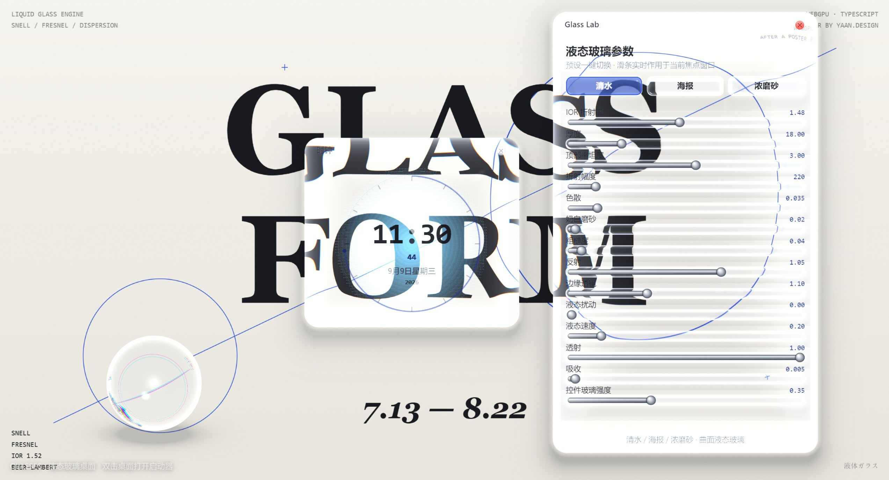
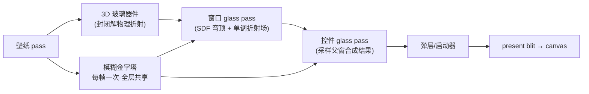

# Glasses

基于 **WebGPU** 的液态玻璃桌面渲染引擎。
桌面本身是承载「物理可信的液态玻璃」材质与合成的平台；窗口、控件、弹层均统一在
同一套 SDF + 折射管线之下，如同一整块玻璃切削出的界面。

> TypeScript 7 strict + Vite 8 + WGSL。架构上隔离平台层，便于日后移植原生
> （Metal / Vulkan / wgpu / Dawn）。



*Glass Lab 调校窗口、时钟窗口与 3D 玻璃球——全部窗口折射同一场景，字样在弯折
带中呈现色散边缘。*

## 特性

**渲染**

- 🪟 **液态玻璃窗口** — 曲面穹顶高度场 + 构造性单调折射偏移场 + 每通道色散 +
  抛光轮廓发丝线 + Beer-Lambert 吸收，物理参数驱动（IOR / 厚度 / 粗糙度 / 色散…）
- 🔮 **3D 玻璃器件** — 球体走封闭解真物理：双次 Snell 折射、Schlick Fresnel、
  全内反射暗环、弦长吸收；作为桌面物件被窗口再次折射
- 🧊 **控件级玻璃** — 按钮 / 滑条 / 开关复用同一 glass pass，采样已合成的父窗口
  场景，薄板材质自动派生
- 💧 **流体开合** — 窗口以透明薄片出现，折射场与穹顶逐渐「凝固」成透镜，scale
  带回弹（jelly settle）；关闭反向收缩回液滴
- ✨ **SSAA 内部超采样**（1.25×）— 折射是位移场点采样，欠采样即锯齿；超采样
  一次性滤净轮廓、色散边缘与 RGB 镶边

**工程**

- ⚡ **Render-on-demand** — 脏标记驱动合成；场景静止时每帧只做一次 present
  blit（CPU < 1ms），动画期 120Hz 满帧
- 🔌 **移植抽象** — `PlatformHost.createPaintSurface` 是唯一画布构造路径；
  app / engine / runtime / shell 逻辑层零浏览器运行时依赖，Web 专属像素路径
  隔离在单个文件内
- 🧪 **Glass Lab** — 13 个滑条实时调校玻璃物理/美学参数，三预设一键切换

## 操作

| 操作 | 说明 |
|------|------|
| 拖拽标题栏 | 移动窗口（背景实时弯折） |
| 点击关闭按钮 | 流体收缩关闭窗口 |
| 双击桌面空白 | 打开启动器 |
| `` ` `` 或 `Ctrl+Space` | 切换启动器 |
| `Esc` | 关闭启动器 |
| 拖拽左下角玻璃球 | 移动 3D 玻璃器件 |
| `F3` | 切换 stats-gl 性能面板 |
| Glass Lab 预设 | 一键切换 清水 / 海报 / 浓磨砂 基调 |
| Glass Lab 滑条 | 实时调节液态玻璃物理/美学参数 |

启动后会自动打开 **Glass Lab** 与 **时钟** 两个示例窗口。

## 快速开始

```bash
npm install
npm run dev
```

浏览器打开终端提示的本地地址（默认 `http://localhost:5173`）。
需要支持 **WebGPU** 的浏览器（较新的 Chrome / Edge 等）。

```bash
npm run typecheck   # TypeScript 检查
npm run build       # 生产构建
```

## 渲染管线

每帧一次全屏合成，窗口 / 控件 / 弹层在 ping-pong 链上依次折射已合成的场景：



### 为什么「构造性」折射？

物理双界面求解得到的偏移分布是钟形（非单调）——背景在轮廓处被采样两次、
跳过一段，打印为镜像折叠的鬼影。UI 玻璃必须呈现**一张**连续图像，所以窗口级
折射偏移场沿径向直接构造：主体微透镜项单调过渡到边带弯折项，结构上保证映射
单调、永不折叠（详见 [docs/devlog-liquid-glass.md](docs/devlog-liquid-glass.md)）。
3D 器件（球体）轮廓处倒像与暗环是**产品特性**而非缺陷，因此走真实物理求解——
两套方案共享同一管线与 uniform 布局。

### 性能模型

- 模糊金字塔每帧构建一次，窗口 / 控件 / 弹层共享
- 着色器 uniform 早退：`liquidity=0` 跳过 fbm、`dispersion=0` 三采样合一、
  `roughness≈0` 跳过模糊纹理
- 每层 scissor 限位，重型片元只跑在玻璃足迹附近
- 静止帧零合成：脏标记 + 缓存帧重present

## 架构

```
src/
  platform/         # 平台抽象（types）与 Web 实现（设备、表面、输入、时钟）
  engine/           # 合成器、ping-pong 链、液态玻璃着色器（pane + solid）
  runtime/          # 帧循环、调度器、事件总线、调试面板
  shell/            # 桌面、窗口管理、启动器、控件构建
  app/              # 应用 API、注册表、内置应用（Glass Lab / 时钟）
  math/             # 几何与缓动（平台无关）
```

**移植就绪的边界**：

- `PlatformHost.createPaintSurface(w, h, dpr)` 是唯一合法的画布构造路径
- `PaintSurface.backend` 是 opaque 的，仅 `shell/content-gpu.ts`（纹理上传）
  触达——原生移植只需重写该文件与平台 host
- WebGPU 依赖收敛在 `platform/web/` 与组合根 `main.ts`

## 设计文档

| 文档 | 内容 |
|------|------|
| [docs/architecture.md](docs/architecture.md) | 总体架构、分层、模块边界、移植策略 |
| [docs/liquid-glass.md](docs/liquid-glass.md) | 液态玻璃物理模型与渲染管线 |
| [docs/devlog-liquid-glass.md](docs/devlog-liquid-glass.md) | 开发日志：物理方案为何失败、当前方案如何构造 |
| [docs/desktop-shell.md](docs/desktop-shell.md) | 精简桌面 Shell、窗口、输入、焦点 |
| [docs/app-system.md](docs/app-system.md) | 应用挂载、生命周期、简单调度 |
| [docs/roadmap.md](docs/roadmap.md) | 版本范围与演进路线 |

## 挂载自定义应用

```ts
import type { AppModule } from '@/app/types';

export const myApp: AppModule = {
  manifest: {
    id: 'demo.hello',
    name: 'Hello',
    icon: '✨',
    defaultSize: { width: 360, height: 240 },
  },
  create(ctx) {
    return {
      onMount() {
        ctx.window.setTitle('Hello');
        ctx.content.invalidate();
      },
      onRender(surface) {
        const c = surface.get2D();
        c.clearRect(0, 0, surface.width, surface.height);
        c.fillStyle = ctx.theme.text;
        c.font = `20px ${ctx.theme.fontUi}`;
        c.fillText('Hello, Glass!', 24, 48);
      },
      onDispose() {},
    };
  },
};

// main.ts
desktop.registerApp(myApp);
```

应用只绘制**内容层**（Canvas2D 贴膜）；玻璃边框、折射、阴影由引擎统一合成。
内容与材质分离是硬边界——玻璃永远只管材质。

## 路线图

- **v0.1** ✅ 效果 Demo：玻璃合成管线 + 桌面 Shell 最小闭环
- **v0.2**（核心完成）曲面液态玻璃：单调折射场重构、控件级玻璃、3D 玻璃球、
  流体开合、SSAA、render-on-demand、移植抽象（余项：窗口缩放、最小化、多实例）
- **v0.3** 全系统液态玻璃：交互态（hover/press 呼吸、指针波纹）、材质分级、
  无障碍对比度模式
- **v1.x** 移植与生态：原生后端 POC（wgpu/Dawn）、应用打包约定

## 技术栈

- TypeScript **7.x**（strict）
- WebGPU + WGSL
- Vite 8
- `@webgpu/types` · `stats-gl`

## 许可证

待定。
